## how to install a package

    install.packages("package_name)
    
there are a lot of options to this method. like c++

## how to load a library
    library(package Name)

## how to see all the loaded library

    library()
  
## only base packages
  
    library(lib.loc = .Library)
  
## how to get the name of methods in a given package

    library(help = splines)
## how to get structure of an object

    str(obj_name)
    # can also use 
    summary(obj_a)
    
## how to see the files in current directory

    dir()
    
## how to find a specific pattern in current directory
    ls(pat = "specific_pattern)

## how many data types are there
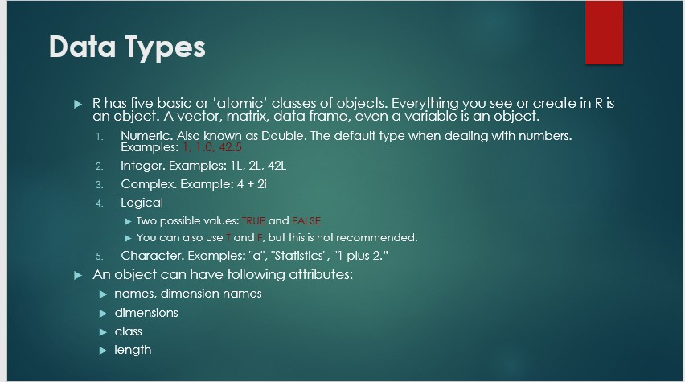

## setting name attributes 
    
    names(obj) <- value
    
    # or if u want to see the names
    
    names(obj)
    
## Data Structures
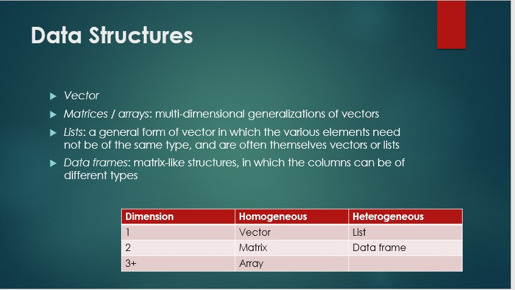

## what is order of corercion
The ordering is roughly logical < integer < numeric < complex < character
so logical will be integer

## to check class of any object

    class(obj_name)
    
## if have time, investigate the typeof() function

## how to initialize vectors
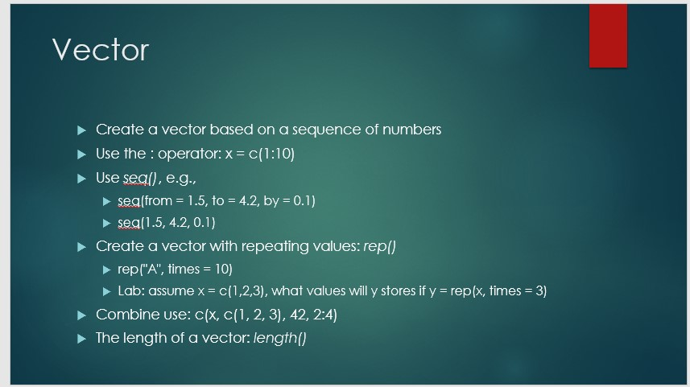

## how to index vectors
the upper limit of the range is also included in the result
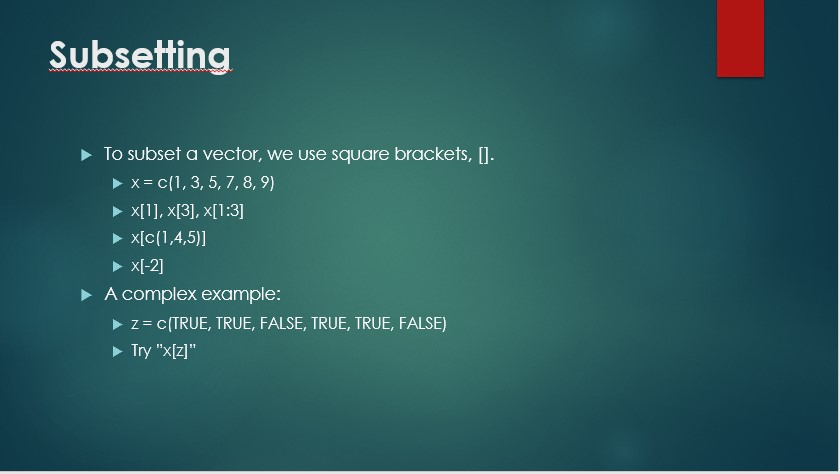

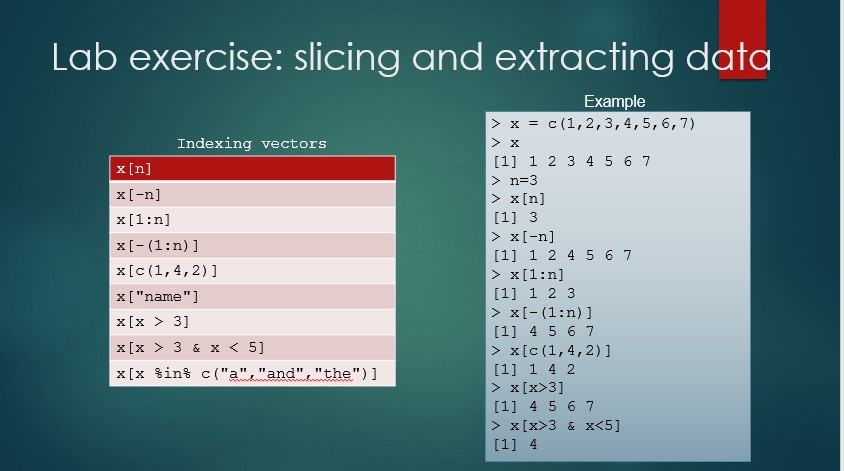

## how to reverse elements of a vector
    
    rev(x)
## how to replicate 

    rep(1,9)
    >[1] 1 1 1 1 1 1 1 1 1
## Matrix initialization

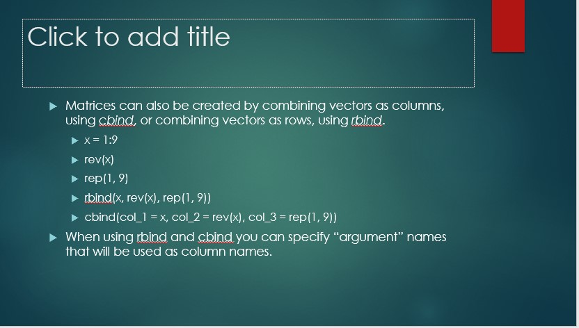
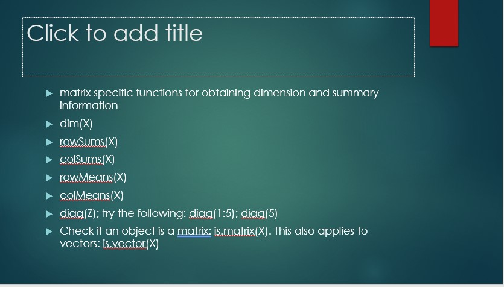

## list initialization
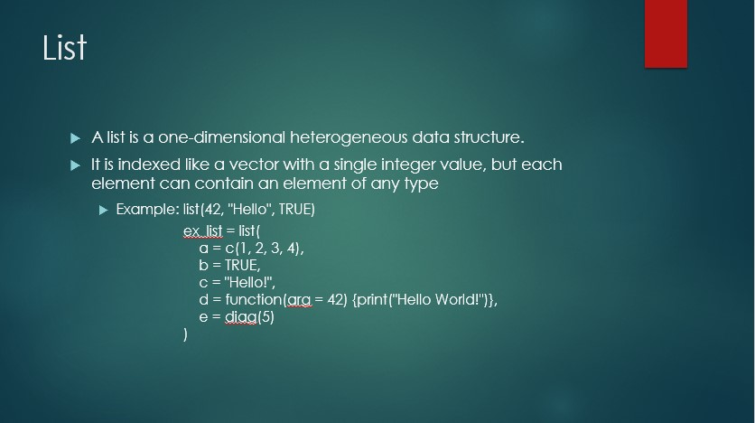

## list operation
`ls[[1]]` and `ls$a` return the same type of data. but `ls[1]` return a list
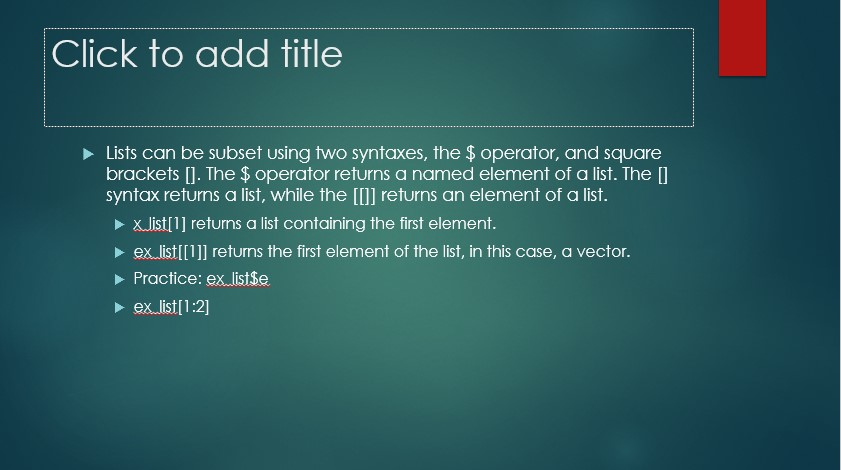
look at the example, this way we can also specify the name of element of a list
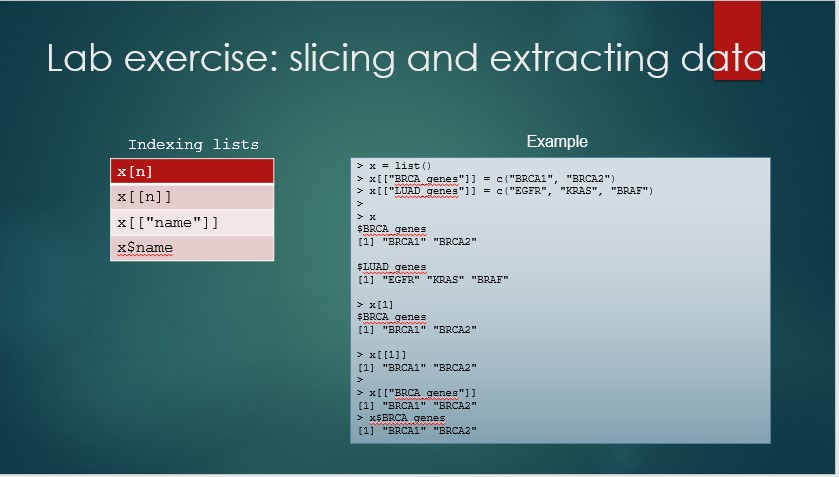

## how to create a dataframe

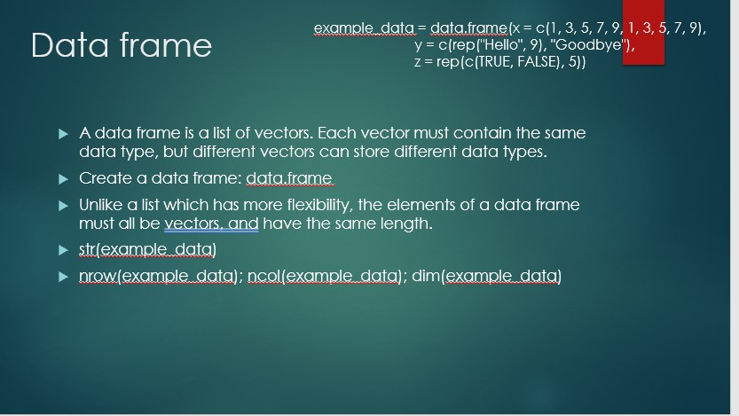

## how to subset the dataframe

we know the exact location of rows and columns

    ed_exp1 <- education[c(10:21),c(2,6:7)]

Another elegent way: if we know the value of specific column upon which to select rows, and the columns to be selected

    ed_exp2 <- education [which(education$region == 2), names(educations) %in% c("State","Minor.Population","Education.Expenditures")]
    
Another Basic function 
    
   ed_exp3= subset(education, region ==2, select =  c("State","Minor.Population","Education.Expenditures"))
   
Using dplyr

    install.packages("dplyr")
    library(dplyr)
    ed_exp5 <- select(filter(education, Region == 2),c(State,Minor.Population:Education.Expenditures))
    
1. Subset using brackets by extracting the rows and columns we want
2. Subset using brackets by omitting the rows and columns we don’t want
3. Subset using brackets in combination with the which() function and the %in% operator
4. Subset using the subset() function
5. Subset using the filter() and select() functions from the dplyr package

## how to load/install packages if not already loaded/installed

        if((!require("ggplot2")){
        install.packages("ggplot2"))
        library(ggplot2)
        }

## different ways to input/output

### load: will load .rda files

.rda files save the r objects in binary format.

      save(count, age, circumference, file = "mydata.rda")
      #now load
      load("mydata.rda") # it wil search the file in directory returned by getwd()
      
### writing human readable files
[link](https://www.r-bloggers.com/how-to-save-and-load-datasets-in-r-an-overview/)

       write.table(data, 
                    file = "file.csv",
                    sep = "\t",
                    row.names = F,
                    append = F) # append = True will write the file at the end of already present in the disk. 
                    
if the file is huge:
       
       
       library(data.table)
       t0 = Sys.time()
       for (i in 1:10){
                fwrite(data, file = "file.csv",
                sep = "\t",
                row.names = F,
                append = T)
            }
        difftime(Sys.time(),t0)
        
if we want to write an excel file

          library(WriteXLS)
          WriteXLS(data, ExcelFileName = "data.xlsx",
                     SheetNames = "my data",
                     AdjWidth = T,
                     BoldHeaderRow = T)
                     
so basically three arguments are to be given. data, file, row.names.

here to write csv

                write.csv(data, file= "file.csv",
                row.names = F)
                
                
